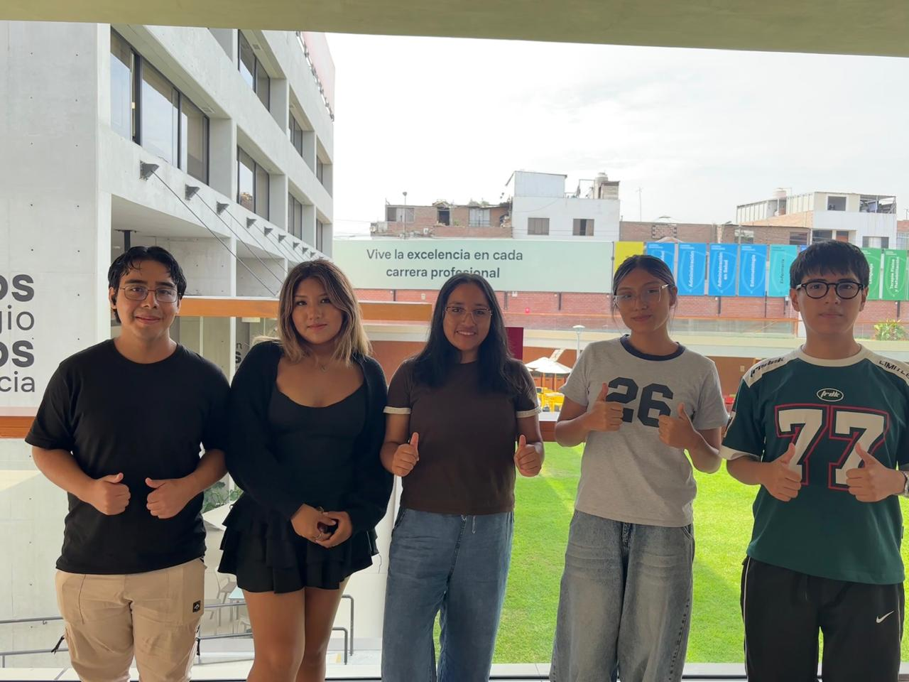
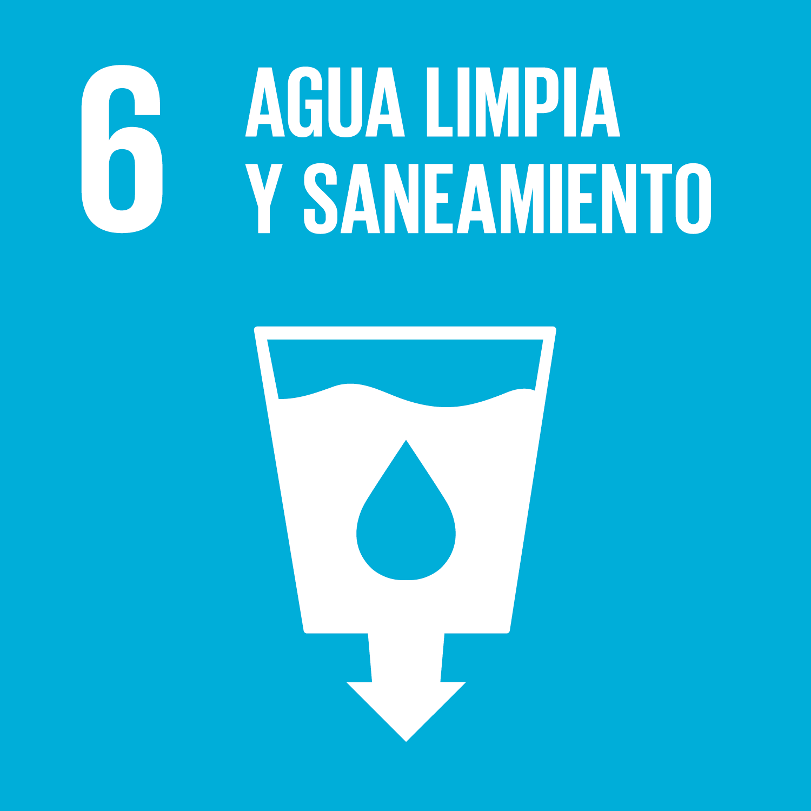
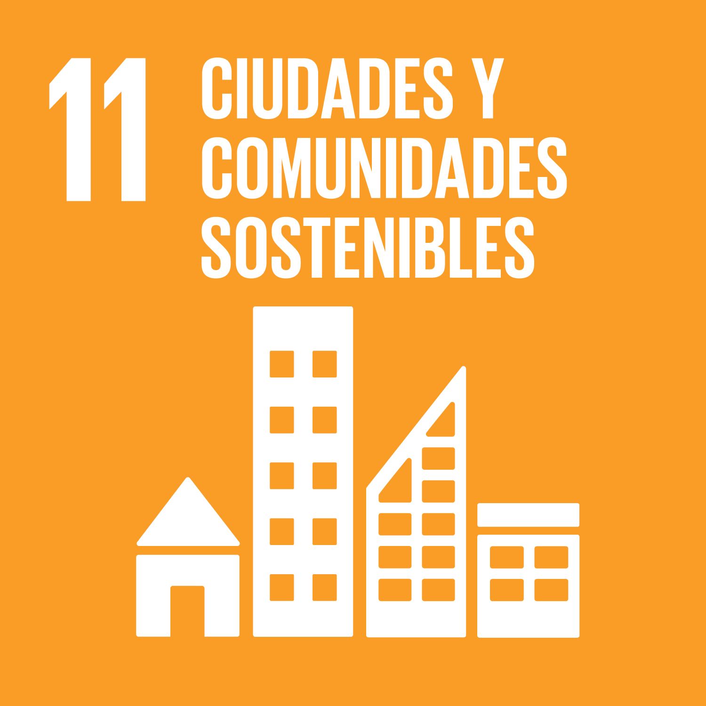
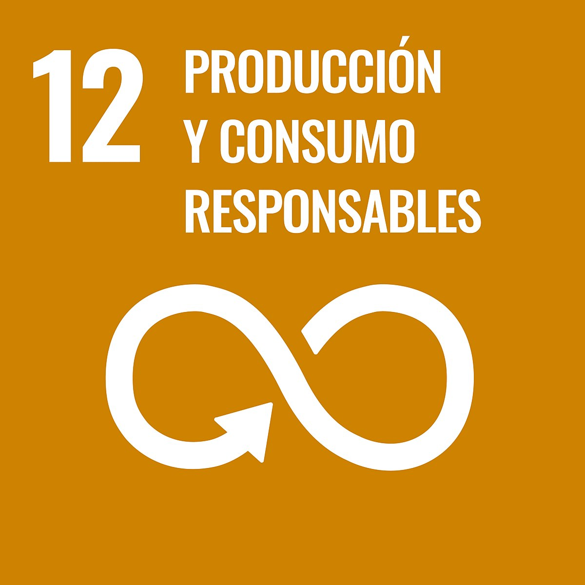
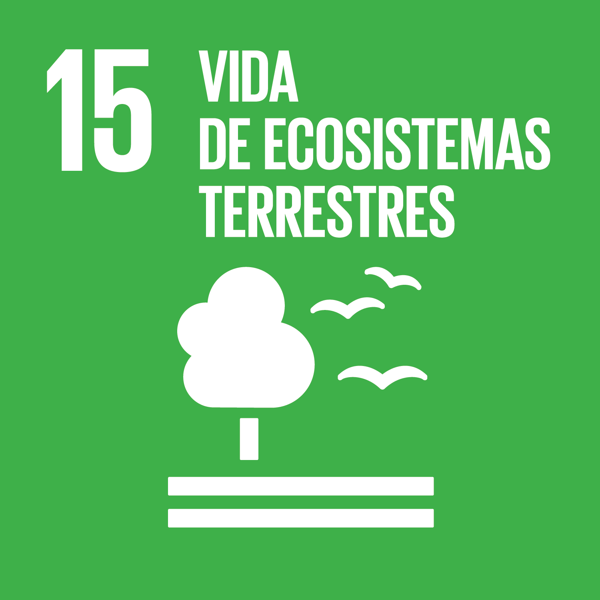

#  Equipo - Procesos de Innovación para Ingeniería

  <strong>Carrera:</strong> Ingeniería Ambiental / Informática / Industrial  
  <strong>Institución:</strong> Universidad Peruana Cayetano Heredia  
  <strong>Periodo:</strong> 2026-1

---

##  Descripción del Equipo
Somos el equipo del curso **Procesos de Innovación para Ingeniería 2026-1**, conformado por estudiantes de las carreras de Ingeniería Ambiental, Informática e Industrial. 

Nuestro objetivo como equipo es aplicar **metodologías innovadoras** para generar soluciones con impacto real en los ámbitos:
- 🌱 **Ambiental**
- 💻 **Tecnológico**
- 🤝 **Social**

---
##  Foto grupal

Nos interesa trabajar en los siguientes Objetivos de Desarrollo Sostenible (ODS):

| ODS 6 | ODS 7 | ODS 11 | ODS 12 | ODS 15 |
| :---: | :---: | :---: | :---: | :---: |
|  |  |  |  |  |
| Agua Limpia | Energía Asequible | Ciudades Sostenibles | Producción Responsable | Vida Terrestre |

---

<h2 align="center">👥 Nuestro Equipo</h2>

| *Foto* | *Nombre* | *Rol* | *Intereses* |
| :---: | :---: | :---: | :---: |
|  | *LESLYE TADEO ARQUINIGO* | Jefe de grupo | Creatividad, liderazgo |
|  | *GIODANO VALERO BONIFACIO* | Programador | Programación, simulación |
|  | *KENNETH RAMOS ESPINOZA* | Diseño | Diseño de prototipos, creatividad |
|  | *NICOLE HUAMANÍ MAMANÍ* | Investigación | Gestión ambiental, análisis |
|  | *YAMILETH TENORIO INOCENTE* | Documentación | Redacción técnica, comunicación científica |

