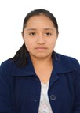

#  Equipo - Procesos de Innovación para Ingeniería

  <strong>Carrera:</strong> Ingeniería Ambiental / Informática / Industrial  
  <strong>Institución:</strong> Universidad Peruana Cayetano Heredia  
  <strong>Periodo:</strong> 2026-1

---

##  Descripción del Equipo
Somos el equipo del curso **Procesos de Innovación para Ingeniería 2026-1**, conformado por estudiantes de las carreras de Ingeniería Ambiental, Informática e Industrial. 

Nuestro objetivo como equipo es aplicar **metodologías innovadoras** para generar soluciones con impacto real en los ámbitos:
- 🌱 **Ambiental**
- 💻 **Tecnológico**
- 🤝 **Social**

---

Nos interesa trabajar en los siguientes Objetivos de Desarrollo Sostenible (ODS):

| ODS 6 | ODS 7 | ODS 11 | ODS 12 | ODS 15 |
| :---: | :---: | :---: | :---: | :---: |
| 💧 | ⚡ | 🏙️ | ♻️ | 🌿 |
| Agua Limpia | Energía Asequible | Ciudades Sostenibles | Producción Responsable | Vida Terrestre |

---

<h2 align="center">👥 Nuestro Equipo</h2>

  

     
    <b>Yamileth Tenorio</b> 
    <b>Jefe de Grupo</b> 
    <i>Sostenibilidad</i>
  

  

     
    <b>Nicole Huamaní</b> 
    <b>Programador</b> 
    <i>Diseño de datos</i>
  

  

     
    <b>Leslye Tadeo</b> 
    <b>Diseño</b> 
    <i>Creatividad</i>
  

  

     
    <b>Kenneth Ramos</b> 
    <b>Investigación</b> 
    <i>Gestión Ambiental</i>
  

  

     
    <b>Giodano Valero</b> 
    <b>Documentación</b> 
    <i>Redacción Teórica</i>
  

---

  

